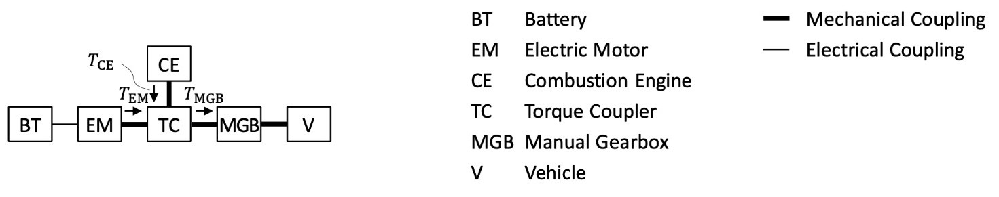
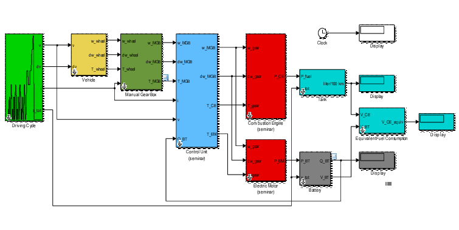
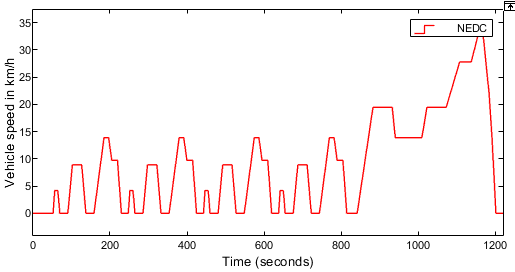
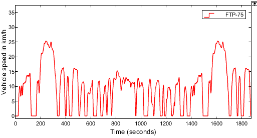
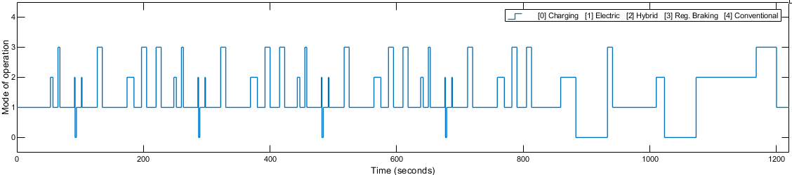
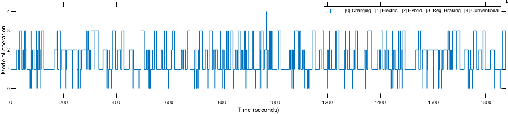
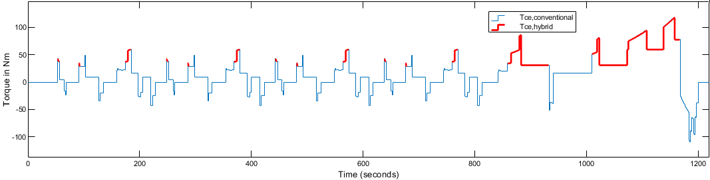
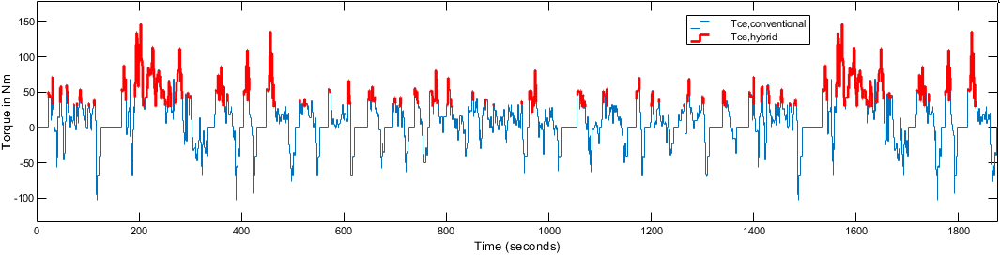
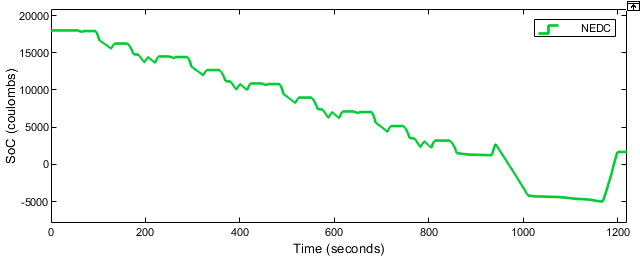
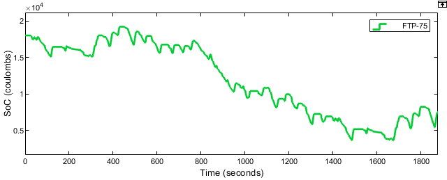

<h1>Rule-based Energy Management System for Hybrid Electric Vehicle</h1>

<h2>Description</h2>
<b>During a seminar presentation within our curriculum, we devised a Rule-based Energy Management System for a Hybrid Electric Vehicle (Mercedes-Benz A 170 CDI (W168)) aimed at minimizing fuel consumption by tuning for optimal selection of operating modes  and electromobility principles for sample test driving cycles.
</b>
<br />
<br />

<h2>Languages Used</h2>

- <b>MATLAB and Simulink</b>

<h2>Library Used</h2>

- <b>QSS Toolbox (MATLAB)

<h2>Vehicle Specifications</h2>

- <b>Model:</b> Mercedes-Benz A 170 CDI (W168)
- <b>Diesel Engine:</b> 66 kW / 180 Nm nominal, 60 kW / 187 Nm measured
- <b>Electric Motor:</b> 12 kW / 60 Nm
- <b>Battery:</b> 16.38 kW / 0.468 kWh / 48 V
<p align="center">
<br>
<em>PHEV</em>
</p>

<h2>Model Components</h2>

- <b>Driving Cycle Map:</b> Provides vehicle speed, acceleration, gear ratio, and total traveled distance.
- <b>Vehicle Model:</b> Represents the Mercedes-Benz A 170 CDI (W168) in the simulation.
- <b>Engine Model:</b> Represents the diesel engine.
- <b>Electric Motor Model:</b> Represents the electric motor.
- <b>Battery Model:</b> Represents the battery.
- <b>Gearbox Model:</b> Applies gear ratios to adjust vehicle parameters.
- <b>Control Unit (Energy Management) Model:</b> Contains logic for engine and electric motor operation.
- <b>Fuel Tank Model:</b> Calculates fuel consumption based on engine power.
- <b>Total Equivalent Fuel Consumption Model:</b> Calculates overall fuel consumption from both engine and electric motor power.
<p align="center">
<br>
<em>QSS Model Components</em>
</p>

<h2>Driving Cycles for Testing</h2>

 - <b>NEDC (New European Driving Cycle):</b> Tests fuel consumption and emission levels.
<p align="center">
<br>
<em>NEDC (New European Driving Cycle)</em>
</p>
  
 - <b>FTP-75 (Federal Test Procedure):</b> Tests fuel consumption and emissions in various driving conditions including city driving, aggressive driving, and highway driving.
<p align="center">
<br>
<em>Figure: FTP-75 (Federal Test Procedure)</em>
</p>


<h2>Rule-Based Strategy</h2>

- <b>Load Point Shifting:</b> Technique to optimize ICE operating point for better fuel economy.
- <b>Energy Management System:</b> Implemented using rule-based strategy in MATLAB.
- <b>Interpreted MATLAB Function:</b> Used to define rules for switching between modes.

<h2>Rule Conditions and Results</h2>

- <b>Rule 1:</b> Regeneration when TMGB < 0.
- <b>Rule 2:</b> LPS (Motor mode) when TMGB ≥ TED,max.
- <b>Rule 3:</b> LPS (Gen. mode) when TED,th < TMGB < TLPS,gen,th.
- <b>Rule 4:</b> Electric Driving when TMGB < TED,th and wMGB < wMGB,th.
- <b>Rule 5:</b> Conventional (Engine only) as default.

<h2>Mode Descriptions</h2>

- <b>A. Electric:</b> Default mode with engine OFF and torque split ratio u = 1.
- <b>B. Hybrid:</b> Engine continually running, torque split ratio u varies.
- <b>C. Charging:</b> Electric device charges battery, u < 0.
- <b>D. Regenerative Braking:</b> Engine OFF, 0 < u < 1, TMGB < 0.
- <b>E. Conventional:</b> Default mode when none of the rules apply.

<p align="center">
<br>
<em>Figure: Rue-base driving modes for NEDC</em>
</p>
<p align="center">
<br>
<em>Figure: Rue-base driving modes for FTP-75</em>
</p>

<h2>Torque Output</h2>
<p align="center">
<br>
<em>Figure: Torque for NEDC</em>
</p>
<p align="center">
<br>
<em>Figure: Torque for FTP-75</em>
</p>

<h2>State of Charge (SoC)</h2>
<p align="center">
<br>
<em>Figure: Battery SoC for NEDC</em>
</p>
<p align="center">
<br>
<em>Figure: Battery SoC for FTP-75</em>
</p>

<h2>Optimization of Parameters</h2>

| Parameter                                       | Optimal Value |
|-------------------------------------------------|---------------|
| Torque threshold for LPS in motor mode (TED,max)      | 33 Nm         |
| Torque threshold for LPS in generator mode (TLPS,gen,th) | 34 Nm         |
| Torque threshold for Electric mode (TED,th)            | 29 Nm         |
| Velocity threshold for Electric mode (wMGB,th)         | 300 rad/s     |
| Maximum torque-split factor for LPS (uLPS,max)         | 0.01          |


<h2>Results</h2>

| Driving Cycle | Combustion Engine | EMS on EHV | Improvement |
|---------------|-------------------|------------|-------------|
| NEDC          | 5.572 l/100km     | 3.019 l/100km | 45.81% |
| FTP-75        | 5.319 l/100km     | 3.111 l/100km | 41.51% |

<h2>References</h2>

- <b>D. Goerges, “Seminar Electromobility (summer term 2022),” May 2022.
- <b>F. R. Salmasi, ”Control Strategies for Hybrid Electric Vehicles: Evolution, Classification, Comparison, and Future Trends,” in IEEE Transactions on Vehicular Technology, vol. 56, no. 5, pp. 2393-2404, Sept. 2007.
- <b>H. Banvait, S. Anwar, and Y. Chen, “A rule-based energy management strategy for plug-in hybrid electric vehicle (PHEV),” in 2009 American control conference. IEEE, 2009, pp. 3938–3943.
- <b>Barthel, Jochen and Gorges, Daniel and Bell, Markus and Munch, Philipp, ”Energy management for hybrid electric tractors combining load point shifting, regeneration and boost”, in 2014 IEEE Vehicle Power and Propulsion Conference (VPPC), 2014, pp. 1-6.
- <b>Lawler, Benjamin and Ortiz-Soto, Elliott and Gupta, Rohit and Peng, Huei and Filipi, Zoran S, ”Hybrid electric vehicle powertrain and control strategy optimization to maximize the synergy with a gasoline HCCI engine” in SAE International Journal of Engines, Volume 4, 2011 JSTOR, pp. 1115-1126.
- <b>Bielaczyc, Piotr and Woodburn, Joseph and Szczotka, Andrzej, ”Exhaust emissions of gaseous and solid pollutants measured over the NEDC, FTP-75 and WLTC chassis dynamometer driving cycles” in 2016 SAE Technical Paper.
- <b>XiZhang and ChrisMi. Vehicle Power Management: Modeling, Control and Optimization, Springer, London,2011.


<!--
 ```diff
- text in red
+ text in green
! text in orange
# text in gray
@@ text in purple (and bold)@@
```
--!>
